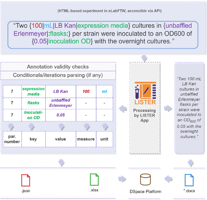
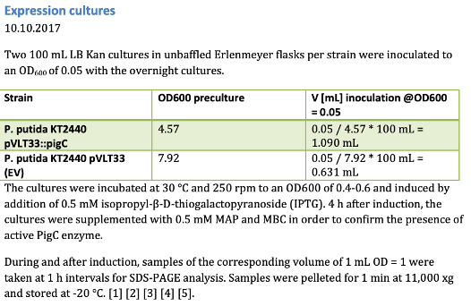
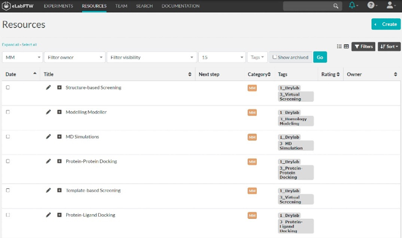
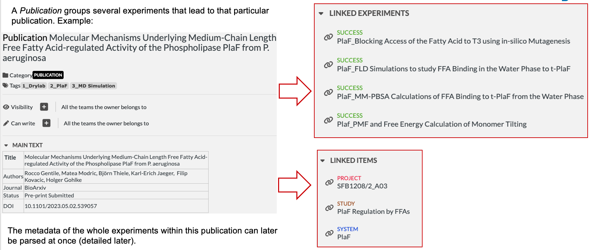
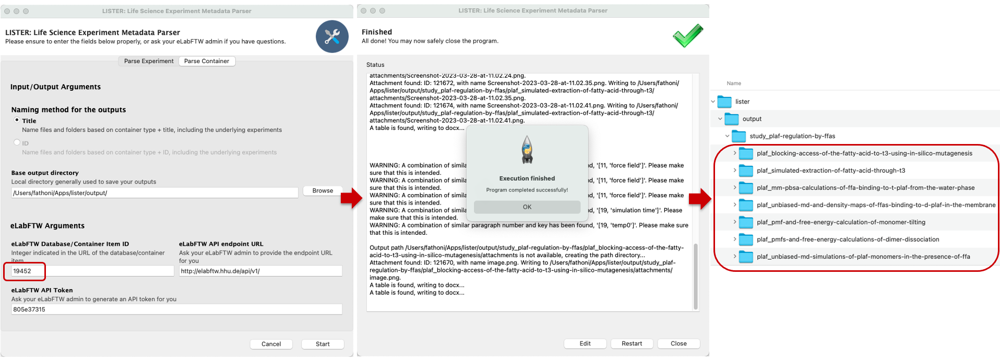
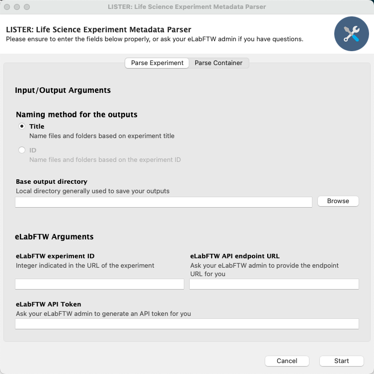
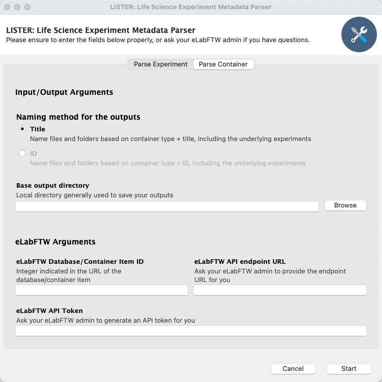
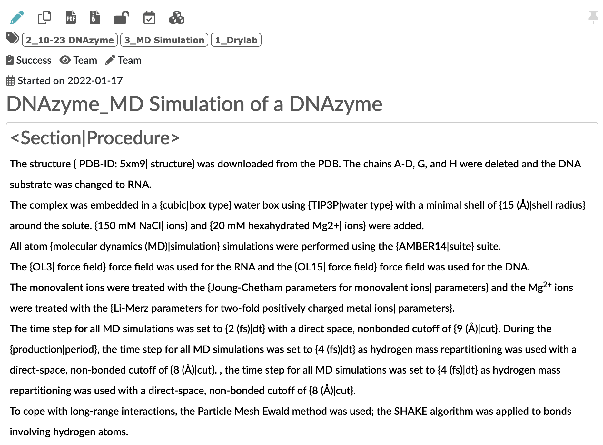
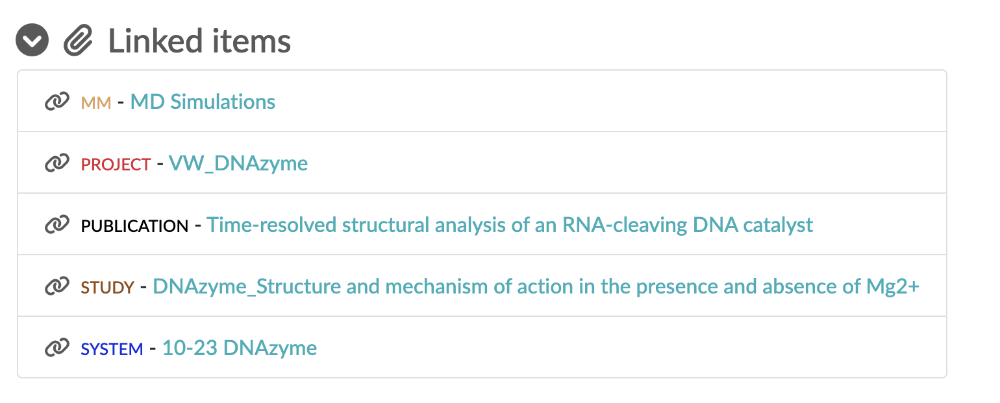
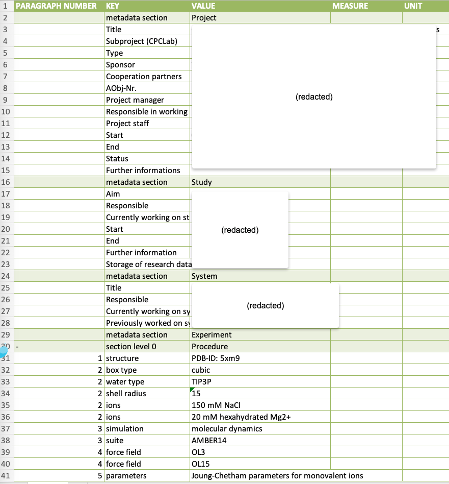

# LISTER: Life Science Experiment Metadata Parser

**TL;DR:**
**LISTER** is a worfklow and a tool that:
- Parses annotated experiment documentation from **eLabFTW**
- Extracts structured metadata in **Excel and JSON**
- Produces a **clean Word document** without annotations
- Supports both **single experiments** and **grouped containers** (like publications or projects)
- Aim to improves **findability, reproducibility, and accessibility** of research metadata
- The extracted metadata is indexable by data platform CMS **DSpace v7 onwards**, allowing contextual metadata search on the platform

---

# Table of Contents

- [LISTER: Life Science Experiment Metadata Parser](#lister-life-science-experiment-metadata-parser)
  - [Overview](#overview)
  - [Screenshots](#screenshots)
    - [User interface](#user-interface)
    - [eLabFTW annotations](#elabftw-annotations)
    - [Outputs](#outputs)
  - [Installing and running LISTER](#installing-and-running-lister)
    - [Adapting the config.json file](#adapting-the-configjson-file)
  - [Annotation mechanism](#annotation-mechanism)
    - [Examples of annotations vs. extracted metadata](#examples-of-annotations-vs-extracted-metadata)
    - [Supported operators](#supported-operators)
      - [Logical operator](#logical-operator)
      - [Iteration operator](#iteration-operator)
    - [Parsable entries comparison](#parsable-entries-comparison)
    - [Document validation](#document-validation)
    - [Image extraction](#image-extraction)
    - [Recommendations](#recommendations)
  - [GitHub repository structure](#github-repository-structure)
  - [Miscellaneous](#miscellaneous)
    - [Packaging LISTER](#packaging-lister)
    - [Troubleshooting](#troubleshooting)
      - [Platform-agnostic Troubleshooting](#platform-agnostic-troubleshooting)
      - [Windows Troubleshooting](#windows-troubleshooting)
      - [macOS Troubleshooting](#macos-troubleshooting)
  - [Additional Resources](#additional-resources)
  - [Citing LISTER](#citing-lister)

## Overview

LISTER simplifies metadata extraction for eLabFTW experiments, enhancing findability and reproducibility. It saves time in research documentation by organizing metadata into accessible Excel files, making it easy to read for humans and processable by machines, as shown in Table 1.

Par. No. | Key | Value | Measure | Unit
--- | --- | --- | --- | ---
\- | section level 0 | Remarks |  | 
\- | section level 0 | Precultures |  | 
4 | Date of experiment | 29.09.2017 |  | 
5 | expression strain | P. putida KT2440 pVLT33::pigC |  | 
5 | negative control | empty vector strain |  | 
5 | inoculum | single colony |  | 
5 | growth media | LB Kan | 5 | mL
5 | temperature | 30 |  | °C
5 | shaking | 250 |  | rpm
5 | time | overnight |  | 

_Table 1. An example of the extracted metadata from LISTER in tabular Excel format._ 

LISTER's metadata extraction uses a simple annotation mechanism, allowing experiment documentation writers to highlight important metadata pairs. This system is designed to be intuitive and readable for both humans and machines, as shown in Figure 1.



_Figure 1. Lightweight annotated experiment document snippets are extracted for (a) metadata in JSON and Excel format and (b) clean Word documentation_

LISTER extracts metadata and generates a clean Word document by removing annotations. The resulting document is simplified, making it ready for sharing or publication and ensuring experiments can be easily reproduced, as shown in Figure 2.




_Figure 2. An example of a Word experiment documentation generated by LISTER._ 

LISTER's annotation process integrates with eLabFTW's protocol/materials and methods catalog. Pre-annotated protocols using LISTER's annotation scheme (see details in Figure 3 below) can be imported into experiment entries with a single click in eLabFTW. This ensures consistent research documentation without requiring manual annotation from scratch. However, the actual values used must still be manually adapted.



_Figure 3. A collection of pre-annotated reusable catalog entries that can be imported to relevant experiments._

LISTER allows you to extract metadata for all experiments within specific groupings (*containers*) like *publication*, *project*, *study*, or *system* with a single click. It also lets you include additional information about these groupings, such as a *publication's* title, authors, journal, status, and DOI. This enhances the context and usability of the extracted metadata. An example of this feature is shown in Figure 4.



_Figure 4. A publication consists of several linked experiments, all of which can be extracted for their metadata in a single click._

LISTER simplifies eLabFTW organization by ensuring experiments are well-structured and accessible. With one click, it generates a folder for each experiment containing a clean Word document (without annotations), an Excel file of metadata, a JSON metadata file, and any provided attachments. This structured output is ready for publication, sharing, and archival, as shown in Figure 5.



_Figure 5. A study container, once extracted, will have their experiments' metadata, documentation, and attachments extracted into respective subfolders._

The resulting metadata, once uploaded into a platform based on the Data Portal CMS DSpace 7,  will be indexed for searchability. DSpace7 also supports logical search operators to search the key-value pairs for your metadata.


## Screenshots

### User interface



_Figure 6. User interface for parsing an experiments._



_Figure 7. User interface for parsing a container (e.g., Publications, Project, etc)._

### eLabFTW annotations



_Figure 8. How the annotation is done to enable parsing via LISTER. This annotated fragment can be derived from reusable, 
and lab-curated experiment protocols/material and methods. See the Annotation Mechanism section below._



_Figure 9. Linked items section of an experiment, in which the tabular content will be parsed to gather more context
w.r.t. e.g., Study, Project, and System._

### Outputs



_Figure 10. Metadata output in the Excel sheet, after parsing with LISTER._

## Installing and running LISTER

LISTER is distributed as an executable file for Windows, Linux, or macOS (with an Intel chipset). The executable file for each platform is available on the release page, along with another, platform-specific file.

- **For Windows and Linux**, place the executable file (`lister.exe `on Windows or `lister` on Linux) within the same folder as the `config.json` file.

- **For macOS**, create the directory `~/Apps/lister` first and place the executable `lister.app` and `config.json` in this directory.

### Adapting the config.json file

Parsing an eLabFTW entry requires

- general parameters
  
  - eLabFTW `API token` and `API endpoint`, which can be obtained from the eLabFTW instance's administrator of the lab or university,
  
  - Default output directory, i.e., a directory path used to store the parsing outputs

- specific parameter
  
  - `Experiment ID` or `Database ID` for the entry to be parsed.

## Annotation mechanism

The annotation mechanism allows extracting metadata from experiment documentation as .xlsx and .json files. In the following points, the basic elements of annotating protocol/MM to be parsed by LISTER are described.

- *Key-Value (KV) elements*.
  
  - A KV pair is written as `{value|key}` in an experiment entry.
  
  - If applicable, a KV pair is extendable with measure and unit. Therefore, there are two more variations for writing a KV pair:
    
    - `{measure|unit|key}` the measure and unit will be mapped into value and unit.
    - `{measure|unit|value|key}` the measure and unit will be taken as given.
  
  - For example, “*Two* *{100|mL|LB Kan|expression media}* *cultures in* *{unbaffled Erlenmeyer|flasks}*” consists of two patterns of pair:
    
    - `{measure|unit|value|key}` -> `{100|mL|LB Kan|expression media}`
    - `{value|key}` -> `{unbaffled Erlenmeyer|:flasks:}`
  
  - Keys are hidden by default in the .docx output file to avoid superfluous text.
  
  - To make the keys visible, they can be placed within colons as `{value|:key:}`, such as `{unbaffled Erlenmeyer|:flasks:}`”.

- *Order.*
  
  - As there can be identical keys within an experiment entry, disambiguation is needed.
  - The disambiguation is done through the *paragraph number*, which will be extracted and associated with each KV pair.

- *Comments*. There are three types of comments supported in LISTER.
  
  - Comments parsed as-is.
    - This retains both brackets and content in the word document.
    - Annotation is done using a regular bracket `()`.
    - Annotation example: `(This comment will be parsed as is, retaining both the content and the brackets in the .docx file.)`.
  - Invisible comments.
    - Used to specify additional notes (regarding, e.g., parameter use) that should be hidden from the final experiment documentation output.
    - Annotation is done using a pair of underscores inside a regular comment. `(_ _)`
    - Annotation example: `(\_This comment will be invisible in the .docx output file.\_)`.
  - Comments are retained but without brackets.
    - This is typically used for comments within KV pairs.
    - Annotation is done using brackets and a double colon `(: :)`
    - Annotation example: `(:This comment's bracket will be invisible in the .docx output file, but the text content will be kept.:)`.

- *Conditionals and iterations handling*.
  
  - LISTER supports documenting conditionals and iterations, but this should be used cautiously: As the final experiment documentation is unlikely to have these conditional and iteration clauses, researchers are required to resolve them by adapting the experiment parameter values with the actual values used during the experiment.

- *Reference management*.
  
  - References can be provided if the referred source has a DOI.
  - Annotation is done using regular brackets and providing the DOI (not URI) in the bracket.
  - The DOI will be converted into Arabic numerals in square brackets, which refer to the reference provided at the bottom of the document.
  - References are only retained in the docx output, but not the metadata outputs (.xlsx/.json).
  - Example: `(DOI_CODE)`, such as `(10.1073/pnas.062492699)` will be written as `[1]` in the experiment body, and as a numbered list of DOI codes by the end of the experiment documentation.

- *Sections*.
  
  - The keywords section or subsection are designated to provide a separation between sections or subsections.
  - This is done by using the `<section|section name>` annotation.
  - Multiple subsections are also supported, with e.g., `<subsubsection|section name>`, which will output different sectioning levels in the .xlsx and .json files and different heading levels in the .docx file.

### Examples of annotations vs. extracted metadata

| **Extracted item**                                                             | **Description**                                                                                                                                                          | **Representation**                                                                     | **Example**                                 | **Extracted order,key, value, and optionally measure, unit in the metadata**                                                                                                                                                                                                                                                                                 |
| ------------------------------------------------------------------------------ | ------------------------------------------------------------------------------------------------------------------------------------------------------------------------ | -------------------------------------------------------------------------------------- | ------------------------------------------- |--------------------------------------------------------------------------------------------------------------------------------------------------------------------------------------------------------------------------------------------------------------------------------------------------------------------------------------------------------------|
| Section                                                                        | The section name                                                                                                                                                         | `<section\|section name>`                                                              | `<section\|Structure Preparation>`          | `"-",section level 0,Structure Preparation, -, -`                                                                                                                                                                                                                                                                                                            |
| Order                                                                          | The *order* of the steps, based on the order of the paragraph in the experiment documentation                                                                            | -                                                                                      | -                                           | -                                                                                                                                                                                                                                                                                                                                                            |
| Key                                                                            | The *key* for the metadata, connected to the value                                                                                                                       | `{value\|key}`                                                                         | `{sequence alignment\|stage}`               | `<order>, stage, sequence alignment, -, -`                                                                                                                                                                                                                                                                                                                   |
| Comment, please also see the bullet points about comments above for variations | *Comments* are allowed within the key-value annotation, represented within regular brackets. Comments can be placed both/either before and/or after the key and/or value | `{value\|(comment) key} or {value (comment)\|key} or {value (comment)\|(comment) key}` | `{receptor residue\|(minimization) target}` | `<order>, target, receptor residue, -, -`                                                                                                                                                                                                                                                                                                                    |
| Value                                                                          | The *value* of the metadata is the first item within the curly brackets                                                                                                  | `{value\|key}`                                                                         | `{sequence alignment\|stage}`               | <order>, `stage, sequence alignment, -, -`                                                                                                                                                                                                                                                                                                                   |
| Measure and Unit                                                               | The measure and unit of corresponding key/value pairs                                                                                                                    | `{measure\|unit\|value\|key}`                                                          | `{100\|mL\|LB Kan\|expression media}`       | `<order>, expression media, LB Kan, 100, mL`                                                                                                                                                                                                                                                                                                                 |
| Value and Unit                                                                 | In some cases, value is attached to a unit directly, without having to provide a measure                                                                                 | `{value\|unit\|key}`                                                                   | `{250\|rpm\|shaking}`                       | `<order>, shaking,250, -, rpm`                                                                                                                                                                                                                                                                                                                               |
| Control flow: `for each`                                                       | Extract multiple key-value pairs related to `for each` iteration                                                                                                         | `{value\|unit\|key}`                                                                   | `<for each\|generated pose>`                | `<order>, step type,iteration, -,- `       `<order>, flow type,for each, -,- `       `<order>, flow parameter, generated pose, -,-`                                                                                                                                                                                                                          |
| Control flow: `for`                                                            | Extract multiple key-value pairs related to `for` iteration                                                                                                                | `<for\|key\|[range]\|iteration operation\|magnitude>`                                  | `<for\|pH\|[1-7]\|+\|1>`                    | -`<order>, step type,iteration, -, - `     `<order>, flow type,for, -, -`               `<order>, flow parameter, pH, -, -`        ` <order>, flow range, [1-7], -, -`    `<order>, start iteration value,1, -, -`            `<order>, end iteration value,7, -,-` .      `<order>, flow operation, +,-, -  `      `<order>, flow magnitude, 1, -, -`      |
| Control flow: `while`                                                          | Extract multiple key-value pairs related to `while` iteration                                                                                                            | `<while\|key\|logical operator\|value> ... <iterate\|iteration operation\|magnitude>`  | `<while\|pH\|lte\|7> ... <iterate\|+\|1>`   | `<order>, step type,iteration, -, -`          `<order>, flow type,while, -, - `                `<order>, flow parameter, pH, -, -`               `<order>, flow logical parameter, lte, -, -`           `<order>, flow compared value, 7*, -, -<order>, flow type,*iterate*(after while) ` `<order>flow operation, +,-, -` `<order>, flow magnitude, 1, -, -` |
| Control flow: `if`                                                             | Extract multiple key-value pairs related to `if` iteration                                                                                                               | `<if\|key\|logical operator\|value>`                                                   | `<if\|pH\|lte\|7>`                          | `<order>, step type,conditional, -,-`          `<order>, flow type,*if, -, -*`                 `<order>, flow parameter, pH. `         `<order>, flow logical parameter, lte, -, -  `       `<order>, flow compared value, 7`                                                                                                                                |
| Control flow: `else if`                                                        | Extract multiple key-value pairs related to `else if` iteration                                                                                                          | `<else if\|key\|logical operator\|value>`                                              | `<else if\|pH\|between\|[8-12]>`            | `<order>, step type,conditional, -, -`         `<order>, flow type,*else if, -, -`    ` <order>, flow parameter, pH, -, -`              `<order>, flow logical parameter, between, -, -`        `<order>, flow range, [8-12], -, -`       `<order>, start iteration value,8, -, -`     `<order>, end iteration value,12, -, -`                               |
| Control flow: `else`                                                           | Extract multiple key-value pairs related to `else` iteration                                                                                                             | `<else>`                                                                               |                                             | `<order>, step type,conditional, -, -`    `<order>, flow type,else, -, -`                                                                                                                                                                                                                                                                                    |

### Supported operators

#### Logical operator

A logical operator is used to decide whether a particular condition is met in an iteration/conditional block. It is available for while, if , and else if control flows. The following logical operators are supported:

- `e`: equal

- `ne`: not equal

- `lt`: less than

- `lte`: less than equal

- `gt`: greater than

- `gte`: greater than equal

- `between`: betweenk  
#### Iteration operator

An iteration operator is used to change the value of a variable in a loop. It is available for while and for. The following iteration operators are supported:

- `+`: iteration using addition

- `-`: iteration using subtraction

- `%`: iteration using modulo

- `*`: iteration using multiplication

- `/`: iteration using division

### Parsable-entries comparison


|                                      | Instance example                         | Can the table be parsed as metadata?                                                   | Can annotated text be parsed?                                        | Should the the metadata specified before (be it table OR annotated text) be parsed?                              |
| ------------------------------------ | ---------------------------------------- | -------------------------------------------------------------------------------------- | -------------------------------------------------------------------- | ---------------------------------------------------------------------------------------------------------------- |
| Experiment entries                   | -                                        | No, we still need to define how heterogenous table can be extracted to key-value pairs | Yes                                                                  | Yes                                                                                                              |
| Management-instance database entries | Project, System, Study                   | Yes, as long as it is in a  two-column structure                                       | No, it is deemed to be unnecessary as KV are already in tabular form | Yes                                                                                                              |
| SOP-instance database entries        | MM, Method, Methods, Protocol, Protocols | No                                                                                     | Yes                                                                  | No, it should have already been inserted into the experiment instead, and the parameter should have been adapted |
| Container-instance database entries  | Publication                              | Yes                                                                                    | No, it is deemed to be unnecessary as KV are already in tabular form | Yes                                                                                                              |


### Document validation

LISTER checks and reports the following syntax issues upon parsing:

- Orphaned brackets.

- Mismatched data types for conditionals and iterations.

- Mismatched argument numbers for conditionals and iterations.

- Invalid control flows.

### Image extraction

Images are extracted from the experiment documentation, but there is no metadata or naming scheme for the extracted images.

### Recommendations

- Avoid referring to, e.g., a section without explicitly using a key-value pair (avoid, e.g., "*Repeat step 1 with similar parameters*"), as this will make the metadata extraction for that particular implicit step impossible.

- To minimize confusion regarding units of measurement (e.g., `fs` vs `ps`), please explicitly state the units within the value portion of the key-value pair, e.g., `{0.01|ps|gamma_ln}`.


## Miscellaneous

### GitHub repository structure

- The base directory contains the metadata extraction script.
- The output directory contains the extracted metadata: step order – key – value – measure – unit in JSON and XLSX format.


### Packaging LISTER

- Packaging is done through the PyInstaller library and has to be done on the respective platform. PyInstaller should be installed first.

- A .spec file to build LISTER can be generated using the pyi-makespec command, e.g., `pyi-makespec --onedir lister.py` to create a spec file to package the LISTER app as one directory instead of one file.

- The spec file for each platform is provided in the root folder of the LISTER GitHub repository.

- The resulting packaged app will be available under the dist directory, which is created automatically during the build process.

- It is recommended to use virtual environments using python's venv or anaconda.
  
  - Using venv
    
    - create venv virtual environment inside lister directory named `venv` which will use python3.9 as the interpreter: `python3.9 -m venv venv` 
    
    - set IDE to use the created `venv` environment as python interpreter to use - in pycharm it is in the *Settings* - *Project: lister* - *Python Interpreter* - *Add Interpreter* which is set to `/lister/venv/bin/python`
    
    - activate the venv environment: `source venv/bin/activate`
    
    - install required libraries: `pip install xlsxwriter gooey python-docx elabapy beautifulsoup4 pyinstaller pandas latex2mathml`
    
    - build using the build scripts mentioned below

#### Packaging the app on Windows

- One directory version - on the root folder of the repo, run `pyinstaller .\build-scripts\build-windows-onedir.spec`

- One file version - on the root folder of the repo, run `pyinstaller  .\build-scripts\build-windows-onefile.spec`

#### Packaging the app on Linux

- One file version - on the root folder of the repo, run `pyinstaller build-scripts/build-linux-onefile.spec`

#### Packaging the app on macOS

- One file version - on the root folder of the repo, run `pyinstaller build-scripts/build-macos-onefile.spec `

### Troubleshooting

#### Platform-agnostic Troubleshooting

##### Slow Initial Launch

Decompressing a single-executable lister app into a temporary directory likely caused this problem. The multi-file distribution (aka one-directory version) can be used instead, although it is not as tidy as compared to the single-executable LISTER app.

##### GUI Text Contrast

LISTER only supports the default OS' light theme, a custom user/dark theme is therefore not supported.

#### Windows Troubleshooting

##### Encoding Error

When the following error `'charmap' codec can't encode characters in position... `appears, open `cmd.exe` as an administrator before running LISTER and type the following:

`setx /m PYTHONUTF8 1`

`setx PATHEXT "%PATHEXT%;.PY"`

##### Windows: packaging failure

The error `win32ctypes.pywin32.pywintypes.error: (110, 'EndUpdateResourceW', 'The system cannot open the device or file specified.'` happens because of file access problems on Windows. Ensure that  the directory is neither read-only nor auto-synced to cloud storage , exclude the repo folder from antivirus scanning, and/or try removing both the `build` and `dist` directories. Both of these directories are automatically generated upon packaging. Cloud storage synchronization may also be the cause of this issue.


#### macOS Troubleshooting

##### Dependencies Not Included

Please consider using environment management system such as anaconda to package the app. Install conda locally along with the dependencies stated in the `requirements.txt`. In the release, python 3.9.15 was used. LISTER runs fine on macOS v13.0.1 and macOS v10.12.4 within intel machines.

##### Unable to Get Into GUI

Running `lister.py` directly from your IDE on macOS may lead to the following message:

`This program needs access to the screen. Please run with a
Framework build of python, and only when you are logged in
on the main display of your Mac.`

Run the script from terminal using `pythonw lister.py` instead.

##### macOS 14: Secure Coding is not Enabled...

The following warning appears when running `lister.py` directly in terminal:

`Python[67201:349757] WARNING: Secure coding is not enabled for restorable state! 
Enable secure coding by implementing NSApplicationDelegate.applicationSupportsSecureRestorableState: and returning YES.`

This warning can be ignored and does not affect the functionality of LISTER.


##### "Client Error: Forbidden for url: ..."

The `requests.exceptions.HTTPError: 403 Client Error: Forbidden for url:...` happens because the specified API token/key does not have access rights to an entry (or its underlying entries). 
Check that the user with specified token has access to the entries directly linked to the experiments/database items/containers.

##### "requests.exceptions.ConnectionError: ..."

If the following error: 
`requests.exceptions.ConnectionError: HTTPConnectionPool(host='..., port=80): Max retries exceeded with url: ... (Caused by NewConnectionError('<urllib3.connection.HTTPConnection object at ...>: Failed to establish a new connection: [Errno 61] Connection refused'))`
occurs, use `https` instead of `http` as an API endpoint. 

---
# Additional Resources

Some resources are avaible to try out LISTER on your own:

- eLabFTW-importable Structure and comments to see how we implement our eLabFTW structure: https://github.com/CPCLab/lister-container.
- eLabFTW-importable Materials and methods examples, annotated with LISTER annotation rules: https://github.com/CPCLab/materials-and-methods.

# Citing LISTER

BibTex:

```bibtex
`@article{doi:10.1021/acs.jcim.3c00744,
author = {Musyaffa, Fathoni A. and Rapp, Kirsten and Gohlke, Holger},
title = {LISTER: Semiautomatic Metadata Extraction from Annotated Experiment Documentation in eLabFTW},
journal = {Journal of Chemical Information and Modeling},
volume = {63},
number = {20},
pages = {6224-6238},
year = {2023},
doi = {10.1021/acs.jcim.3c00744},
    note ={PMID: 37773594},
URL = {https://doi.org/10.1021/acs.jcim.3c00744},
eprint = {https://doi.org/10.1021/acs.jcim.3c00744}
}`
```


RIS:

```ris
TY  - JOUR
T1  - LISTER: Semiautomatic Metadata Extraction from Annotated Experiment Documentation in eLabFTW
AU  - Musyaffa, Fathoni A.
AU  - Rapp, Kirsten
AU  - Gohlke, Holger
Y1  - 2023/10/23
PY  - 2023
DA  - 2023/10/23
N1  - doi: 10.1021/acs.jcim.3c00744
DO  - 10.1021/acs.jcim.3c00744
T2  - Journal of Chemical Information and Modeling
JF  - Journal of Chemical Information and Modeling
JO  - J. Chem. Inf. Model.
SP  - 6224
EP  - 6238
VL  - 63
IS  - 20
PB  - American Chemical Society
SN  - 1549-9596
M3  - doi: 10.1021/acs.jcim.3c00744
UR  - https://doi.org/10.1021/acs.jcim.3c00744
ER  - 
```

